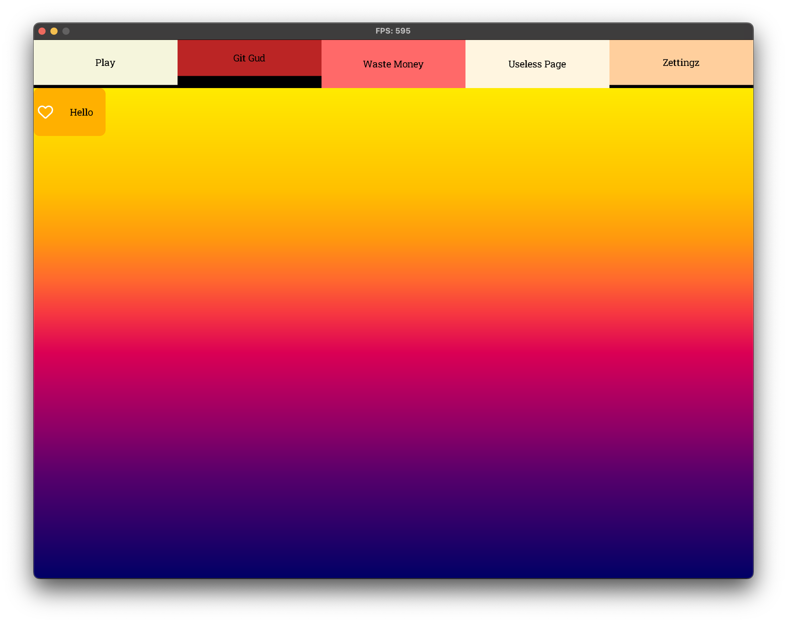

===




### FAQ (no one actually asked these questions, i am making them up):

```
Q: What is this?
A: Another typescript UI framework .. but for `love2d`!
```

```
Q: Why not lua?
A: I love typescript :(
```

```
Q: How to use?
A: I have no idea, I'm still working on it.
```
```
Q:  Why?
A: I love react. `typescript-to-lua` is an awesome project, it allows the generation of lua code even from React TSX code. Since in my humble opinion is the best way to write user interfaces, I have decided to try it with love2d.
```
```
Q: What do I expect from this?:
A: Only building blocks! You should be able to create your own components and use them in your projects.
```

#### Here is a snippet!
```tsx
let root: BaseComponent =
    <Div key="main" style={{ width: love.window.getMode()[0], height: love.window.getMode()[1] }}>
        <Grid style={{ width: "100%", height: "100%" }}
            columnsPattern={["1fr"]}
            rowsPattern={["1fr", "10fr"]}>
            <Grid style={{ width: "100%", height: "100%"}}
                columnsPattern={["1fr", "1fr", "1fr", "1fr", "1fr"]}
                rowsPattern={["1fr"]}>
                <Div key="grid-1" style={{ width: "100%", height: "100%", backgroundColor: "#F5F5DC", borderBottomWidth: 5, borderColor: "#000000"}}>
                    <TextBox halign="center" valign="center" style={{ width: "100%", height: "100%" }} fontAssetName="defaultFont_30">Play</TextBox>
                </Div>
                <Div key="grid-1" style={{ width: "100%", height: "100%", backgroundColor: "#BB2525", borderBottomWidth: 20, borderWidth: 0, borderColor: "#000000" }}>
                    <TextBox halign="center" valign="center" style={{ width: "100%", height: "100%" }} fontAssetName="defaultFont_30">Git Gud</TextBox>
                </Div>
                <Div key="grid-1" style={{ width: "100%", height: "100%", backgroundColor: "#FF6969"}}>
                    <TextBox halign="center" valign="center" style={{ width: "100%", height: "100%" }} fontAssetName="defaultFont_30">Waste Money</TextBox>
                </Div>
                <Div key="grid-1" style={{ width: "100%", height: "100%", backgroundColor: "#FFF5E0",  }}>
                    <TextBox halign="center" valign="center" style={{ width: "100%", height: "100%" }} fontAssetName="defaultFont_30">Useless Page</TextBox>
                </Div>
                <Div key="grid-1" style={{ width: "100%", height: "100%", backgroundColor: "#FFCF9D",  borderBottomWidth: 5, borderColor: "#000000"}}>
                    <TextBox halign="center" valign="center" style={{ width: "100%", height: "100%" }} fontAssetName="defaultFont_30">Zettingz</TextBox>
                </Div>
            </Grid>
            <Div key="grid-1" style={{ width: "100%", height: "100%", backgroundColor: new GradientColor("linear", "270deg", null, null, null, [
                {color: Color.fromString("hsl(240deg, 100%, 20%)"), position: "0%"},
                {color: Color.fromString("hsl(289deg, 100%, 21%) "), position: "21%"},
                {color: Color.fromString("hsl(315deg, 100%, 27%)"), position: "30%"},
                {color: Color.fromString("hsl(329deg, 100%, 36%)"), position: "39%"},
                {color: Color.fromString("hsl(337deg, 100%, 43%)"), position: "46%"},
                {color: Color.fromString("hsl(357deg, 91%, 59%)"), position: "54%"},
                {color: Color.fromString("hsl(17deg, 100%, 59%)"), position: "61%"},
                {color: Color.fromString("hsl(34deg, 100%, 53%)"), position: "69%"},
                {color: Color.fromString("hsl(45deg, 100%, 50%)"), position: "79%"},
                {color: Color.fromString("hsl(55deg, 100%, 50%)"), position: "100%"},
            ]) }}>
                <Button style={{width: 120, height: 80}}>Hello</Button>
            </Div>
        </Grid>
    </Div>
```

#### How to run:
```
cd repo
npm install
npm run build
love game
```

#### Inconveniences:
- Everything must have dims. 
- If you exceed parent dims, it will NOT be clipped. Events might not propagate properly.
- No scrolling when overflow (obviously)
- Bugs, bugs, and more bugs to keep you entertained.
- I almost guarentee you that I will break the API. Tis what I do!